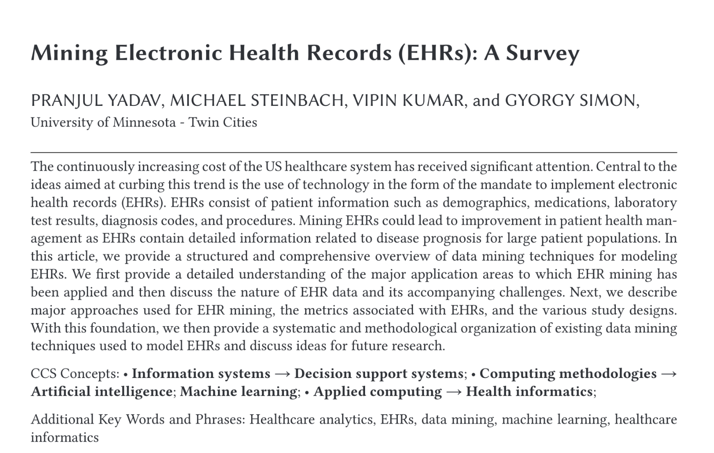
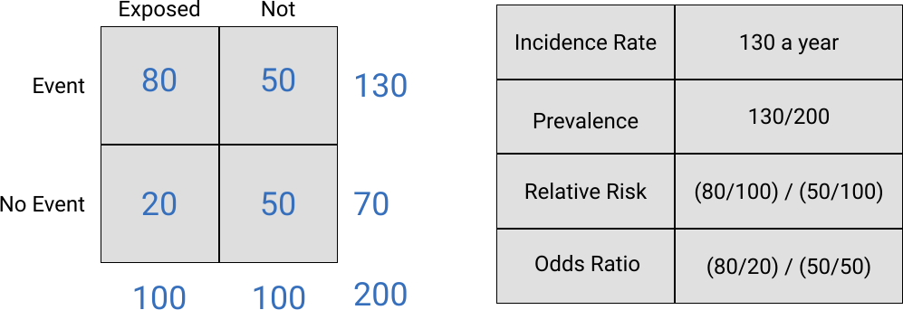
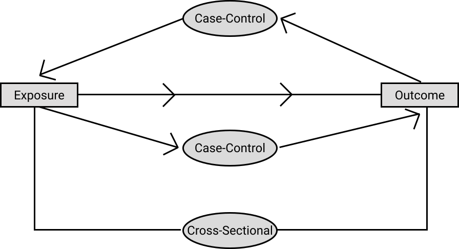
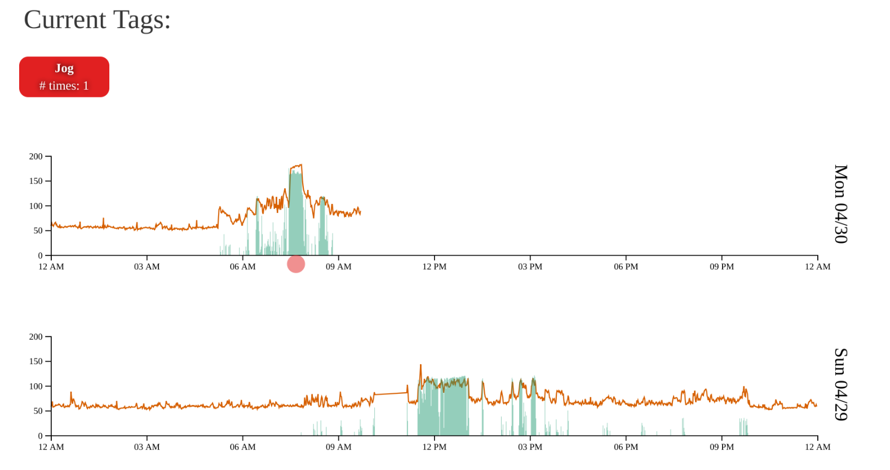
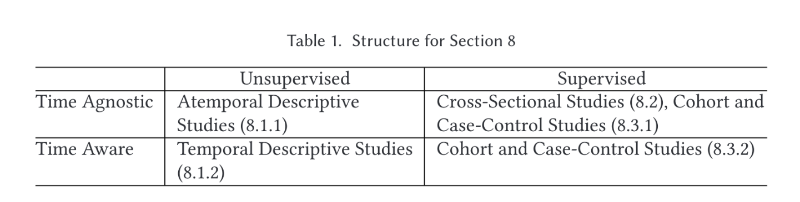

```{r setup, include=FALSE}
options(htmltools.dir.version = FALSE)
```

class: middle, center


---


class: middle
# The paper in a sentence

A whirlwind overview of the strengths, weaknesses, and possible extensions of most of the in-practice methods for 'mining' EHR data. 

---
class: middle

# Layout

This review will roughly follow the layout of the paper. 

1. Introduction to concepts and Motivation
2. Applications Areas
3. The Nature of EHR data
4. Data-Related Challenges
5. Metrics
6. Study Design
7. Approaches (to dealing with challenges)
8. Clinical Data Mining Methodologies
9. Discussion

---

# Introduction to concepts and Motivation

- In an effort to make healthcare more efficient EHR systems have become common in the US. 

- These data are originally made for billing purposes but they still represent a huge sum of information that, with careful effort, hopefully can be extracted to provide research value.

- Unlike traditional data-driven-evidence-based medicine (RCTs) that are massively expensive, this data is (essentially) free. 

.center[

_[source](https://www.pymnts.com/data/2018/datatorrent-jeff-bettencourt-real-time-big-data/)_
]


---
class: middle

# Applications Areas

What are some of the areas of research that EHR data can be used for?

> The fundamental question of medicine is to decide on the treatment that is most suitable and effective for a particular patient, and data mining has the potential to help address this question in numerous ways.


The paper breaks down options into...

- Understanding the natural-history of a disease
- Finding Cohorts
- Quantifying Effects of Intervention
- Constructing Evidence-Based Guidelines ...


---

## Risk Prediction/Biomarker Discovery

We can use EHR data to help build better models for predicting how at risk a given patient is for developing a disease. This information can then be used to single out patients for special treatment. 

The type of model we choose has implications for the question and vis-versa
  - Want to simply make the best prediction? Probably a 'fancy' machine learning method. 
  - Want a traditionally explainable result? Probably want a regression model. 
  
.center[

_[source](https://towardsdatascience.com/linear-regression-in-python-9a1f5f000606)_
]
  
---

## Adverse Event Detection

.pull-left[
> 13.5% of hospitalized Medicare beneficiaries have experienced adverse events, costing Medicare an estimated $340 million in October 2008 alone. An estimated... 15,000 patients per month, experienced an adverse event that led to their deaths... 44% of these adverse events were deemed avoidable.

] 

.pull-right[
- Bad events happening in the hospital are a huge deal with rather staggering statistics associated with them. 

- EHR data through the identification of unnecessary hospitalization situations or providing power to detect drug side effects offers a potential aid to these problems. 

- Ethical benefits...

]

---

class: middle

# The Nature of EHR Data

The paper classifies EHR data into three categories...

- Structured Data
  - Wide spreadsheet style.
- Unstructured Data
  - Notes, Images, etc.
- Flowsheets 
  - Tidy spreadsheet style
  - Is this not just another form of structured data?

---

# Data Related Challenges

What are the problems that we run into with EHR data? (Spoiler: they occur in a lot of data.)

- Censored Data
  - This tends to be a bigger problem in EHR data than it is in more traditional cohort setups.
- Fragmentation
  - No one shares their data well enough.
- Irregular Time-Series Data
  - Patients miss appointments and are models have meltdowns because of it.


.center[

_[source](http://help.synthesisplatform.net/weibull_alta11/images/data_types_summary.png
)_
]
 

---

## Missing Data in general
  
- When a set of data are collected for another purpose, it's understandable that attention may not be payed to things that harm our models. 

- What about more subtle missingness like how well the patient conforms to prescription schedules etc?

- Could standardization of data exchange between systems like Apple's HealthKit help this?


.center[

_[source](https://insideout.com/wp-content/uploads/2016/04/missing-data.jpg)_
]
 
_new favorite google image search: 'missing data.'_
---

## Bias and Confounding

.pull-left[
- Unsurprisingly EHR data is not immune from confounding. 

- How do we know we've adequately matched cases and controls in our studies?

- EHR's tend to have a lot of stuff but they can still easily miss confounding variables such as increased tobacco use associated with birth control usage causing birth control to look like it's causing myocardial infarction. 

]

.pull-right[

_[source](https://www.explainxkcd.com/wiki/index.php/1453:_fMRI)_
]

---

# Metrics

There are about a million ways to quantify result from analyses done on EHR data, but these are a few the paper found important. 


.center[

]

---

# Study Design

Careful and diligent inclusion criteria are needed for deciding what data to gather.  

Special attention needs to be payed to potential confounding/ biases that our choices may entail. 

Analyses done with EHR data fall into the category of __Observational.__ Meaning no researcher intervention. Within this category are two sub-categories: 
- Analytical
- Descriptive

---

## Analytical

Studies that test specific hypothesis about some 'exposure' and an 'outcome.'

- Case-Control: Good for rare events but must be careful with selection-bias.
- Cohort: Easy but have issues with selection bias and censoring.
- Cross-Sectional: Easiest of all designs but completely ignores temporal order.


.center[

]

---

## Observational

- Attempt to define some population of interest and then characterize that population in terms of variables of interest. 

- Can be used for deciding healthcare planning or finding new hypotheses for later testing in analytical or experimental studies.

- 'Correlation studies' can attempt to discern temporal patterns in a very rough attempt at deciphering causality. 


.center[

_[source](http://www.tylervigen.com/spurious-correlations)_
]


---

class: middle

# Approaches


After we've decided on what question we want to ask and we've decided what type of study we want to use to answer it we need to address some of the unique characteristics of EHR data.

These are broken down into:

- Dealing with censoring
- Irregular time-series 
- Confounding

---

## Dealing with Censoring

- Largely done with survival analysis methods like cox regression.

- How do we exactly know what's missing? 
  - Unlike traditional studies where a result may be marked as 'dropped-out' we don't know if absence is censoring or simply no-event. 
  
  
.center[

_[source](http://www.sthda.com/sthda/RDoc/figure/survival-analysis/cox-proportional-hazards-survival-coxph-2-1.png)_
]

---

## Irregular intervals in time data

- Longitudinal-based regression models are the norm.

- Need to decide what type of inference we want.
  - Marginal
  - or Conditional
  
- If traditional inference is not needed, more advanced techniques such as deep-learning methods are catching on.

.center[

]

---

## Confounding

- Careful design is the most powerful method for dealing with this. 

- Propensity score matching or adjustment are really the only data-driven methods for dealing with this. 

- Question: why are propensity models primarily done with logistic regression and not more powerful and modern methods?

.center[

_[source](http://images.slideplayer.com/27/9011705/slides/slide_5.jpg)_
]


---
class: middle 

# Clinical Data Mining Methodologies

EHR data is special in its fantastic temporal information. The paper uses this to divide studies into two major categories: time-aware and time-agnostic. 


.center[

]


---


.pull-left[
## Time-Agnostic

- The easiest way to deal with the time-aware nature of EHR data is to ignore it and squash everything into a single time period. 

- The most obvious example of this is the cross-sectional study design. 

- Many of our more powerful methods (boosted trees, etc) are unable to deal with time-aware data so sometimes this trade off is worth it.

]
.pull-right[
## Time-Aware

- It's certainly harder, but if we utilize time-aware methods the questions we can ask grow. 

- As mentioned this is largely limited to longitudinal-regression models if we want to do inference of any sort. 

]


---

## Clustering

Traditionally a descriptive/ unsupervised method. 

Can be used to find sub-populations in data. 

Lots of methods include K-Nearest-Neighbors, Dirichlet Processes, Hierarchical, Spectral, and more. 


.center[

_[source](https://www.fabian-keller.de/content/5-research/4-high-dimensional-data-visualization/mnist_tsne.png)_
]


---

## Association Analysis

- Borrows from all the time, effort, and money put into selling people things. 

- Can we find {pheno, geno, ...}types that occur together frequently or tend to be predictive of others?

- E.g. Graham Crackers and Marshmallows are usually purchased with Chocolate.


.center[

]

---

class: middle 

## Cohort and Case-Control

__Time-Agnostic:__ do patients who take drug X have a decreased probability of 30-day readmission?

__Time-Aware:__ do patients who take drug X have a lower average number of days till readmission? 

---

## Opportunities from Deep Learning

- Deep learning models are much more flexible than traditional models in terms of what can be used as input. 
  - E.g. Hand-written notes _and_ lab tests can be fed into the same model for prediction.
  
- Transfer learning methods allow us to build upon previous work in a more principled way than say Bayesian methods. 

- Needs research on dealing with censoring. 

---

# Discussion

- Study Designs
  - More work has been done in the supervised/ outcome-oriented methods due to their simplicity
  
- Methods
  - Not enough work has been done looking into the temporal nature of EHR data. 
  - Causal inference on these data is shakey at best.

- Barriers to data mining
  - Translation to clinical practice has been slow.
  - Model interpretation is getting tricky as models get more complicated. 
